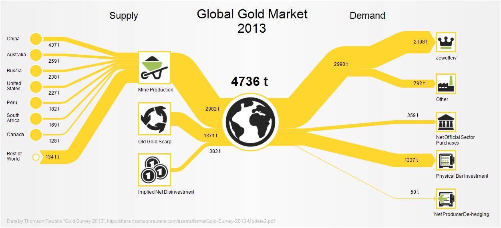

## Sanky Diagram 桑基图

### 原理简介

桑基图（Sankey diagram），即桑基能量分流图，也叫桑基能量平衡图。它是一种特定类型的流程图，图中延伸的分支的宽度对应数据流量的大小，通常应用于能源、材料成分、金融等数据的可视化分析。因1898年Matthew Henry Phineas Riall Sankey绘制的“蒸汽机的能源效率图”而闻名，此后便以其名字命名为“桑基图”。

Charles Minard绘制的的拿破仑1812年入侵俄罗斯战役图

Sankey图表直观地强调了系统内的主要传输或流程。它们有助于确定对整体流量的主导贡献。通常，Sankey图表直观的显示系统边界内的能量守恒。

### 应用场景

某公司能源消耗图

2013全球黄金供需图

科罗拉多河流域分流图

### 实现

#### 开源实现

[D3](https://github.com/d3/d3-sankey)

[Baidu Echarts](http://echarts.baidu.com/examples/editor.html?c=sankey-energy)

[Google Charts](https://developers.google.com/chart/interactive/docs/gallery/sankey)

Python R等语言实现示例

https://zhuanlan.zhihu.com/p/26973515

#### 商业软件

[e!Sankey](https://www.ifu.com/en/e-sankey/)

Power BI

[更多实现](https://en.wikipedia.org/wiki/Sankey_diagram#Sankey_Diagram_Drawing_Tools)

### 数据准备

桑基图数据准备相对简单只有三列数据信息：

起点，终点，权重

虽然只有三列数据，但是桑基图可以做出多级节点，在数据整合上，我们需要事前现将所有节点对应的起点、终点和权重值都顺序的纵向合并为三列字段。

原始数据

桑基图适配后数据

### 参考资料

[维基百科](https://en.wikipedia.org/wiki/Sankey_diagram)

[百度百科](https://baike.baidu.com/item/%E6%A1%91%E5%9F%BA%E5%9B%BE)

#### 彩蛋

e!Sankey Pro 4.5.2 注册版 下载链接:https://pan.baidu.com/s/1X6ICm0-eL7gkh54y5pEwOg 提取码:ikbq 

