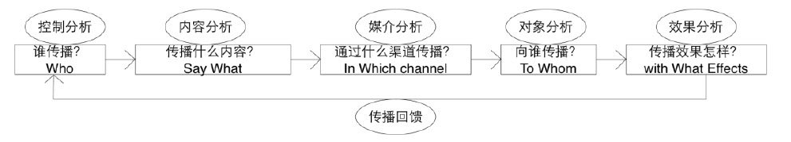

## 内容营销

### 定义

内容营销是指以多种形式的媒体内容，通过多种渠道传递有价值、有娱乐性的产品或品牌信息，以引发顾客参与，并在互动过程中建立和完善品牌的一种营销战略。

提供有价值( 相关、高质量、有教育意义、对购买决策有帮助) 和有娱乐性的吸引眼球的内容是内容营销的制胜法宝。

### 内容

传播者、受传者、传播内容、传播渠道以及传播环境

文字、图片、语音、视频、H5 页面、动图等

### 微信传播特点

半公开化平台：微信朋友圈

私人平台：微信好友与群组

用户行为动机= 28. 5%普遍化趋势+ 25. 4% 便捷生活+ 36. 1%依赖习惯10。

- 基于中国的圈子文化
- 自我展示的需要
- 社会认同的需要
- 社会交往的需要
- 趋利避害的自然选择

### 内容传播特点

高到达率与窄传播

高信任度与紧关系

内容传播的高社交性

### 传播学

大众传播、组织传播、人际传播和人内（自我）传播四种类型。

哈罗德■拉斯韦尔（在其《传播的社会职能与结构》中提到的传播行为的“5W”模式:谁(Who)，说什么(Says What)，通过什么渠道(In Which Channel)，对谁(To whom)，取得什么效果(With what effects)，揭示了传播行为的五大要素，即传播者、讯息、媒介、受众、效果。

“ 议程设置功能” 

指出大众传播具有一种为公众设置“ 意识日程” 的功能， 传媒的新闻报道与信息传播活动以赋予各种“ 议题” 不同程度的显著性的方式， 影响着人们对周围世界的“大事”及其重要性的判断。传统的传播效果包括认知、态度和行动三个层面， “议程设置功能” 主要对第一个层面起作用， 即通过影响大众的认知来影响最终的传播效果

“ 沉默的螺旋”

1. 突出主导意见， 给人们留下深刻的印象； 
2. 证明主导意见的增强， 从而加深人们的印象； 
3. 造成哪种意见不被孤立的强势印象

帕洛阿尔托学派人际传播的五项基本原则： 

1. 人不可能不交流传播；
2. 每一次人际对话中， 同时存在内容信息和关系信息， 后者决定前者；
3. 交流双方会对讯息做不同的组合从而理解其意义； 
4. 人际传播活动同时包含有数字编码和模拟编码； 
5. 交流双方彼此间的关系或是平等的， 或是互补的

约哈里之窗也被称为： “自我意识的发现—反馈模型”， 或“信息交流过程管理工具”。是对如何提高人际交往成功的效率提出,用来解释自我和公众沟通关系的动态变化。是一个介绍自我和相互了解的模型。此理论已被引入到人际交往心理学、管理学、人力资源等领域。

约哈里之窗是一种关于沟通的技巧和理论。它实际上包含的交流信息有： 情感、经验、观点、态度、技能、目的、动机，等等，作为这些信息主体的个人往往和某个组织有一定的联系。根据这个理论，人的内心世界被分为四个区域：开放区、盲目区、隐秘区、未知区

- 开放区（公开）：代表所有自己知道，他人也知道的信息。
- 盲目区（盲点）：代表关于自我的他人知道而自己不知道的信息。
- 隐秘区（隐私）：代表自己知道而他人不知道的信息，这些信息有的是知识性的、经验性的，甚至是创造性思维的结果。
- 未知区（潜能）：这个区域指的是自己不知道，他人也不知道的信息。是潜意识、潜在需要。这是一个大小难以确定的潜在知识。

沟通元

沟通元就是基于一个可复制的共同的基本价值要素，在不同语境中可以不断扩散变异的文化基因。其中可“复制性”和“共同的基本价值要素”决定了沟通元的不断扩散性。沟通元之所以能不断扩散，是因为人们具有某种相似的文化背景和价值认同，在这样基本的价值观认同的基础上，人们寻找某种可把握的、可复制的元素进行再次传播。其中每一个个体在传播扩散的过程中，都会呈现基于个体文化背景和特殊理解的“变异性”，形成沟通元扩散的多样性、丰富性和复杂性。从品牌传播价值的角度，沟通元作为文化符号主要具备以下的品牌传播意义：

### 指标

- 粉丝
  - 粉丝数量
  - 粉丝的活跃度
  - 粉丝的可控性
  - 粉丝的依赖性
- 传播内容
  - 内容的真实性
  - 内容的丰富性
  - 内容的及时性
  - 内容的针对性
- 传播方式
  - 传播的及时性
  - 传播的私密性
  - 传播的到达率
  - 传播的曝光率
  - 传播的互动性

### 提升策略

- 增加粉丝数量，尤其是优质的、活跃的与忠实的粉丝
- 线上与线下多维互动与推广
- 增加内容的丰富性、针对性与时效性，强化互动传播

### 传播过程控制

传播主体、传播内容及传播环境

根据复杂网络的鲁棒性， 我们可以选取对特定节点的控制来达到控制整个网络的目的， 所选取的节点应当是网络结构中的核心节点， 不仅度要大、中介数要大， 该节点的指向也极为重要， 即所能直接影响到的那些节点的重要性。各个领域的“ 意见领袖” 在网络结构中始终是中心节点， 这20%的中心节点占据着网络结构中80%的长尾节点， 对这些中心节点实施控制控制， 就能达到对整个网络传播系统的全局行为的变化， 产生“ 蝴蝶效应” 。我国整个互联网环境中， 新浪、网易、搜狐、腾讯四大门户网站是超级中心节点， 占据着互联网80%的流量， 通过对这些核心网站的控制， 可以实现对某病毒式传播的信息的控制。

通过“ 关键标识” （ 关键标识是指创造出易于流行开来的词汇、帖子或是短语， 吸引注意力， 产生初步规模的聚集， 跟帖与转发强化注意力） 、“ 蜂拥控制” （ 社交网络中最容易出现蜂拥现象， 通过网络中“ 意见领袖” 的引导使得具有共同爱好的人们“ 蜂拥” 在一起， 这个过程是由大量自组织网友个体组成的信息传播系统，在无集中控制的情况下通过网友之间的局部感知作用和相应行为， 使蜂拥整体呈现出一定的宏观传播行为， 从而引起一定规模的“注意力” 并开始蔓延） 展开，
引爆机制是指在启动机制作用之后形成的初具规模的群体中， 通过不断地互动和炒作即通过大量自己人” 的“ 点击” 产生“ 流量”， 使得信息逐渐“ 变热” 。路径控制是指对信息在不同的传播路径的各个分岔节点的“ 分流” 的控制， 通过将
信息疏导至目标节点将信息引爆、从而流行开来， 在网络中形成一定的“ 气候”即信息环境。

### 参考

the spread of behavior in an online social network experiment

李晨，黄灿.微信用户信息分享行为动机研究[J].现代情报，2015，(第5 期).

移动社交网络的传播学研究

广告大观(理论版)Adertising Panorama